## Chapter 1: Reliable, Scalable, and Maintainable Applications
- common data related functionalities:
  - store data (db)
  - remember result of expensive computation (cache)
  - search by keyword/filter (search indexes)
  - send a msg to another process (stream processing)
  - periodically crunch a large amount of data (batch processing)

- 3 major problems: reliability, scalability, maintainability
  - reliable: business execution, tolerate user mistake, access control, performance
    - hardware error: server faults; software error: 3rd party dependency, cascading failure, shared resource used up, bug ; human error
  - scalability: if system grows in a particular way, how to cope
    - load parameter: tps, number of simultaneous active users, ratio read/write etc.
    - tweeter fan-out problem: user follows and followed by many people
      - Solution 1: query db directly, look for people followed and their tweets
      - Solution 2: maintain a cache for each user's home timeline, when post, look up all people following, insert the new tweet into the caches, result is hence computed ahead of time
      - Solution 3: hybrid, celebrities' tweets are fetched separately to followers
    - design problem:
      - if a load parameter increased, how much to increase resources
      - with the same resources, system performance dip when load parameter increases
      - __throughput__: number of records processed per second
      - __response time__: time bet/w a client sending a request and receiving a response, including network delays and queueing delays. __what to look for__: context switch, loss of network packet so TCP retransmission, GC, page faults; ___check percentile!!!!___: cost of optimization vs customer experience (whether to optimize tail latency)
      - __latency__: duration a request waiting to be handled
    - queueing delay & performance testing:
      - most commonly seen performance problem: small number of slow requests blocking all (head-of-line blocking)
      - load-generating client needs to keep sending requests independently of the response time
    - vertical scaling vs horizontal scaling: how to keep data in sync across nodes
    - __volume of reads, volume of writes, volume of data to store, complexity of data, response time measurements, access patterns etc.__
  - maintainability: Operability: visibility, documentation, process, automation etc., Simplicity: understand, coding etc. high-level abstraction to solve accidental complexity, Plasticity: easy to make changes (requirements, use case etc.)

### Chapter 2: Data Models and Query Languages
- JSON/XML/Graph/relational/Document
- each layer hides the complexity of the layers below it by providing a clean data model
- Database is to implement transaction processing and batch processing, meanwhile hide the implementation behind a cleaner interface
- Relational DB now is still the dominant one
- NoSQL
  - Need for greater scalability than relational database
  - Preference for free & open source software over commercial database products
  - specialized query operations
  - more dynamic & expressive data model other than relational schemas
- impedance mismatch: to map relational data into objects
- JSON self-contained data vs multiple joins
- normalization: use ID to represent something so that you only need to update at one place
- NoSQL self-contained data structure may not need join operations that much
- NoSQL easier to represent one-to-many, SQL join works better with many-to-many & many-to-one since these two models require a foreign reference
- Arguments for NoSQL: better performance for locality, closer to data structure modeled
- Arguments for Relational: better join support, many-to-one, many-to-many relationship
- More to cover on fault-tolerance and concurrency
- NoSQL schema on read - schemaless (advantageous when not all items share the same structure), Relational schema on write (check the data before writing)
  - to alter schema, document DB changes code, relational goes for DB migration
#### Query Languages for Data
- SQL like declarative languages are preferable
  - it hides implementation details
  - allow DB engine to optimize (parallel, indexing etc.)
  - map reduce query is a combination of declarative and imperative (more on Chapter 10)
#### Graph-Like Data Models
- natural to model when many-to-many is the dominant relationship in the application
- node as entity, edge as relationship

- property graph:
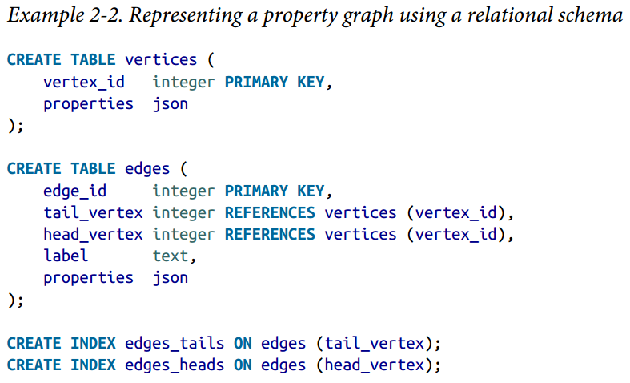
- turtle triples:

- RDF for internet-wide data exchange

### Chapter 3: Data Storage and Retrieval
- As developer, how to store and how to find it again
- store engine: analytics vs transactional workloads
#### log-structured storage engine vs page-oriented storage engine e.g. B-trees
- indexes to speed up read but slow down writes
##### hash map in-memory
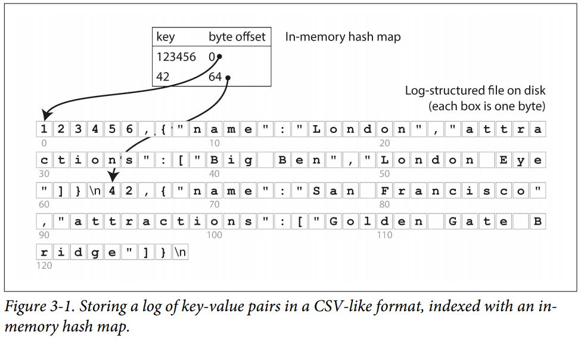
- one algorithm to prevent running out of space: break log into segments of certain size by closing a segment file when it reaches a certain size, then writes to new segment file, then perform compaction on those segments (e.g. throw away duplicate keys in the log and keep only the most recent update for each key)
- merging and compaction process:
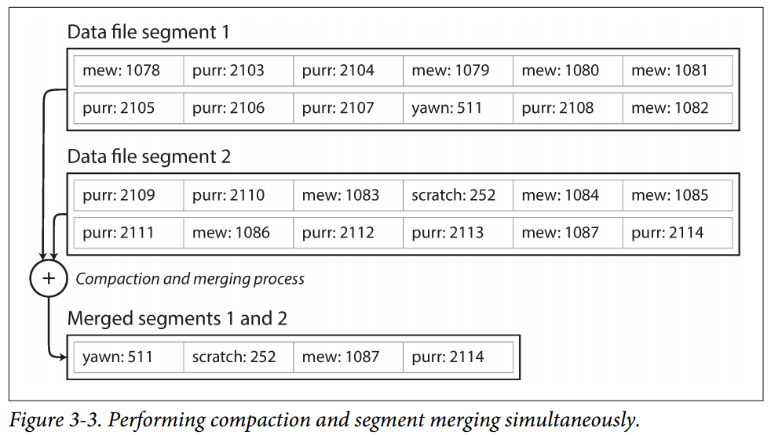
- append-only is fast, with only 1 writer thread to solve concurrency issue
##### SSTables and LSM-Trees
- having keys sorted
- merging segments is simple since it behaves like mergesort algorithm
- key looking is faster since sorted
- possible to group records into blocks
- red-black tree/avl tree to sort keys (memtable)
- Log-structured merge-tree (LSM Tree) -> Cassandra, HBase etc.
- Bloom Filter as a memory-efficient data structure to approximate the contents of a set, tell if a key does not exist in the database
##### B-Tree
- B-Tree uses fix-sized blocks
- B-Tree with n keys has a depth of O(log n)
- Write is to overwrite a page on disk with new data: change in-place (different from LSM-Tree)
- laches (lightweight lock for concurrency control)
- write-ahead log, append-only file to do crash recovery
##### B-Tree vs LSM-Tree
- B-Tree faster for read and LSM-Tree faster for writes
- LSM has lower storage overheads
- LSM write amplification: over the course of database lifetime
- LSM read during compaction is slow
- if write throughput is high, compaction can not keep up with incoming writes, unmerged segments will grow until disk space is not enough. Need to keep monitoring that
- B-Tree index only exist in exactly one place, strong transactional semantics
#### Business Analytics
- different access pattern: scan a large number of records only reading a few columns per record
- Data warehousing:

- a read copy not affecting business operation, data warehouse optimized for query
- normalization (star schema over snowflake schema where dimensions further divided into sub-dimensions), hundreds of columns for analytics
- column-oriented storage to store relational data by column, to read from the nth entry from needed files and then combine
- then compress column data for storage
- sort in different ways in different backup machines
- prepopulating sum for n-dimensional data will speed up query

### Chapter 4: Encoding and Evolution
- Forward & Backward compatibility, since server-side deployment happens one node at a time, client-side code may not even upgrade
- language-specific encoding standards
- language-independent encoding standards: csv, json, XML etc.
- binary encoding: protobuf (allow optional to repeated), thrift, backward and forward compatible
- binary encoding: avro, the most compact, forward & backward compatible, not as compatible as the above 2, compatibility achieved through writer schema and reader. very friendly to dynamically generated schemas. Database schema translated to avro schema, then dumped to avro container file, with schema changes, generate new avro schema, for protobuf, you have to do this field setup manually
- for code generation: avro is optional to cater to the need of weak typed languages
- this new binary encoding allows the same kind of flexibility as shemaless/shema-on-read JSON databases provide

#### Dataflow
##### via Databases
- backward compatibility is important since you need to read the data in the future
- forward compatibility is needed since multiple versions in different nodes are accessing database at the same time
- additional concern, if added a field, how to process without altering that field
- data outlives code :-(   -> data migration, or Avro schema evolution to make the entire database to appear as if it is encoded with a single schema
- during storage archival, snapshot of database is taken, typically encoded using the latest version of schema.

##### via Services
- micro-services each with dedicated business logic
- make the application easier to change and maintain by making services independently deployable and evolvable
- web services: client to server, within the same organization, across organizations
- most popular one: REST, some companies using SOAP
- problems with remote procedure calls: variable response time; timeout; not as predictable as local method call; retry may not be idempotent; impossible to be language-independent; --> so there is no point to make remote procedure call the same as local call
- Custom RPC protocols may achieve better performance, more likely to be used within the same organization within the same datacenter

##### via message passing
- buffer if recipient is unavailable
- redeliver
- 1 message to many recipients
- decouple sender from recipient
- async: no response expected from client
- broker: 1 process sends a message to a named queue or topic, broker then ensures that message is delivered to one or more consumers/subscribers
- there can be many consumers/producers on the same topic

## PART II: Distributed Data
- scalability, fault tolerance/availability, latency
#### shared-nothing architecture (horizontal scaling)
- more popular, since vertical scaling stays in the same region, more costly
- additional complexity for developers
##### Data Distribution
- Replication: keep a copy of the same data on all nodes; vs Partitioning: split big database into smaller ones so different nodes are assigned to different nodes

## Chapter 5
#### Replication
- keep data closer to users
- to allow system to work during node failure
- to scale out the number of machines that can serve read queries
#### Replication algorithms
- single-leader
- multi-leader
- leaderless
##### Leaders & Followers
- leader-based replication(active/passive, master-slave replication)
- one of the replicas is the leader, the only one with write requests
- when leader writes data to its local storage, it sends data change to all followers (replication log/change stream)
- 
- out of box for many DB, or Kafka, RabbitMQ highly available queues
- Synchronous & Asynchronous Replication
- Sync ensures exact copy of leader, but blocks (many choose to be 1 sync follower and others async -- semi-synchronous)
- Many choose to be fully async
##### Failure recovery
- for followers, just process from the last recorded transaction
- leader failure, failover, typical process is leader failure detection, leader election and new leader starts to accept writes
- replication: to replicate statements but may face issue with NOW(), SP etc; write-ahead log shipping: but too low level; logical log replication (change data capture); trigger-based replication: flexible but error prone with more overheads
- Read-after-write consistency: users able to see the writes by himself, but not others (e.g. if reading something reader has modified, read from leader, else from followers; remember user update timestamp; cross-device read-after-write consistency is hard to achieve)

##### Replication Lag Issue & Fixes
- reading your own writes
- monotonic reads: each user always makes their reads from the same replica
- consistent prefix reads: 3rd person will see the conversation in the same order as it goes
- when designing system: important to consider max allowed lag

##### Multi-Leader Replication
- Generally in multi-datacenter operation
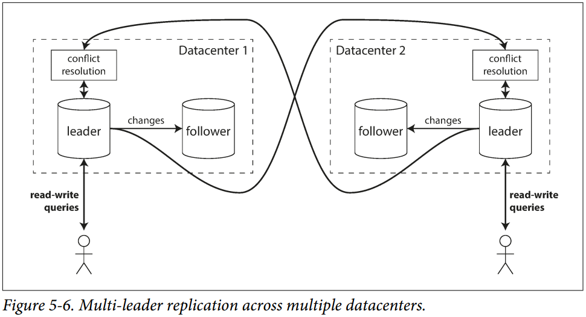
- perceived performance is better for multi-leader, write processed in local DC and replicated asynchronously to the other DCs
- tolerance of dc outages is better since leader in another DC can operate independently
- tolerance of network problems: better in multi-leader since temporary network interruption does not prevent writes
- some databases have internal support, but mostly dangerous for conflict resolution, avoid!
- device acts as a leader locally to support offline operations (every local device is a DC)
- collaborative editing:
  - automatic conflict resolution algorithm
  - write conflict bet/w 2 clients:
  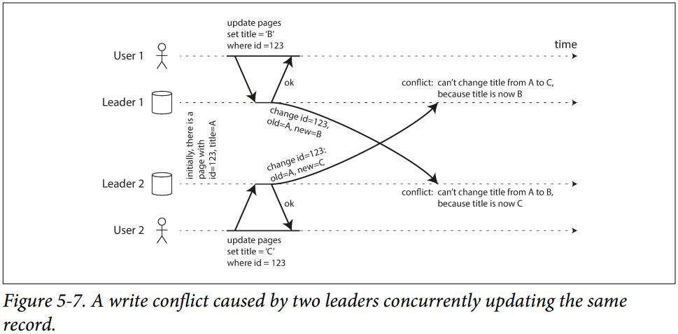
  - conflict avoidance: writes to a particular record go through the same leader
  - use timestamp or ordering unique ID to resolve conflict
  - custom conflict resolution logic: system customized. return all possible, let the system handle the conflict
  - automatic conflict resolution algorithm: conflict-free replicated datatypes, mergeable persistent data structures, operational transformation

##### Multi-Leader Replication Topologies
- if 1 leader, 1 to all
- if more than 2:

- to prevent infinite replication, each node has a unique identifier, each write is tagged with all nodes it passes through
- multi-leader replication writes can arrive in wrong order: version vectors to prevent this
- star or circular prune to network for certain nodes

##### Leaderless Replication
- any replica to accept writes: Dynamo, Cassandra etc.
- Order not that important
- in some implementations, read-write requests both sent to several replicas
- when node is down: write still happens to other replicas, read from several replicas to decide which one has a newer version
- read repair, when read detects inconsistencies, resolve
- anti-entropy process, background process to resolve the conflict

##### quorums for reading & writing
- with n replicas, write must be confirmed by w nodes to be considered successful, must query at least r nodes. as long as w+r>n, we expect up-to-date value when reading
- 
- smaller w & r means higher availability & lower latency, but more likely to read stale value
- no guarantee on some edge cases

##### monitoring staleness
- for leader-based, easy to measure
- for leaderless, hard to monitor, read-repair can lead to long lag

##### Sloppy Quorums & Hinted Handoff
- writes & reads accept w & r successful responses, but include nodes that are not among the designated "home" nodes for a value
- once network interruption is fixed, any writes to that one node are sent to the appropriate "home" nodes (hinted handoff)
- multi-dc operation can follow leaderless replication as well since it is designed to tolerate conflicting concurrent writes, network interruptions and latency spikes

#### Detecting Concurrent Writes
- Last write wins, based on timestamp: e.g. Cassandra
- if losing data is unacceptable, LWW is a poor choice
- the only safe way of using db with LWWW is to ensure that a key is only written once and therefore treated as immutable (e.g. Cassandra -> use UUID as the key)
##### "happens-before" relationship & concurrency
- when B is causally dependent on A
- 3 possibilities: A on B, B on A, independent -> need an algorithm to resolve
- 2 event that occur some distance apart cannot possibly affect each other if the time bet/w the events is shorter than the time it takes signal to travel the distance
- version maintained at server side for every key, increments every time that key is written -> when a key read, server returns all values not overwritten, client must read before write -> when writing a key, must include the version number from the prior read and merge all values it received in the prior read -> when server receives a write with a specific version number, overwrite all values with that version number of below
##### merging concurrent written values
- merging siblings: appropriate version number to indicate that an item has been removed etc.
- algo such as CRDTs to automatically resolve merging siblings

##### version vectors
- similar to happens-before algorithm: a vector of version to store versions across replicas

## Chapter 6
### Partitioning
- partition also known as shard in MangoDB, region in HBase, tablet in Bigtable, vnode in Cassandra and Riak and vBucket in Couchbase
- for scalability, different partitions on different nodes in a shared-nothing cluster

#### Partitioning & Replication
- generally used together, copies of each partition stored on multiple nodes
- choice of replication scheme is independent of choice of partitioning scheme
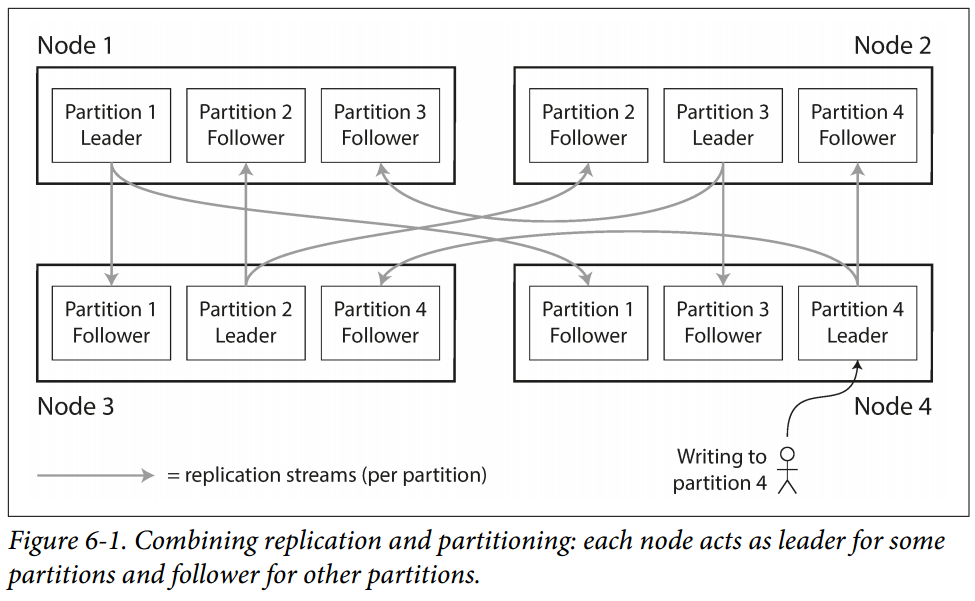
- partition needs to be even, no skew, node with unevenly high load is called hot spot
- random could ensure even distribution, but read will have issue, since it does not know where
- partition by key range is common (e.g. a-c, d-f etc.): some keep keys sorted to facilitate range search
- partition by hash key to make partitioning sufficiently random -> this will lose the ability to do range search
- if a key is known to be hot (e.g. a celebrity) application code could add a random number to the beginning, at the cost of bookkeeping for the additional number

##### Partitioning & Secondary Indexes
- if primary key is the only partitioning key, easier, hard to add secondary keys
- 1. by Document; 2. by Term
- document-partitioned index is known as a local index, need to query all partition to get all needed results -> scatter/gather
- global index to cover data in all partitions (term-partition)

- global index: reads are faster, writes are slower
- in a term-partitioned database, writes may not be reflected immediately (Amazon DynamoDB - updated within a fraction of a second, but may experience longer propagation)
- rebalancing: moving load from 1 node in a cluster to another
- rebalancing requirements: load shared fairly bet/w nodes in the cluster; continue accepting reads & writes while rebalancing; no more data than necessary should be moved bet/w nodes to minimize load/network

##### Rebalancing Strategies
- do not ever use mod!!!! need to move too frequently for the key
- Fix number of partitions: only change the assignment of partitions to nodes

- Dynamic Partitioning: too big->split, too small->merge; some databases do pre-splitting on initial dataset
- some proportional to dataset size, some to number of nodes
- automatic rebalancing is convenient but unpredictable

#### Request Routing
- allow clients to contact any node, if miss, forward to the right one
- require client to be aware of the partitioning
- send to a routing tier first
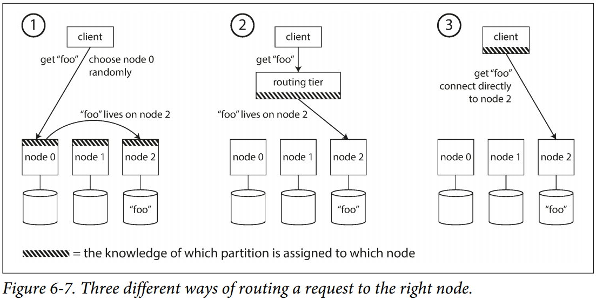
- many distributed data systems rely on a separate coordination service such as ZooKeeper to keep track of this cluster metadata
- Cassandra uses gossip protocol among nodes, additional complexity in the database nodes but avoid external coordination service

#### Parallel Query Execution
- certain analytics oriented products break complex query into many execution stages, allow parallel execution

## Chapter 7: Transactions
- a transaction is a way for an application to group several reads and writes together into a logical unit
- No need to worry about partial failure

#### ACID Meaning
- Atomicity, Consistency, Isolation, Durability
- Atomicity: the ability to abort a transaction on error and have all writes from that transaction discarded
- Consistency: not property of database, but application, certain statements about your data that must always be true
- Isolation: concurrently executing transactions are isolated from each other -> when transactions get committed, the result is the same as if they had run serially. Some DB avoids it due to performance penalty
- Durability: a promise that data written will not be forgotten once a transaction is successfully committed

#### Single-Object & Multi-Object Operations

- most storage engines aim to provide atomicity and isolation on the level of a single object
- some have more complex atomic operations: increment (remove read-modify-write cycle), similar one is compare-and-set operation
- but single-object is not real transaction
- Multi-Object Transactions
  - ensure foreign reference stays valid
  - prevent denormalized data from going out of sync
  - secondary index updates: a record appears in one index but not another
- Retry: dedup needed if transaction already happened, overload should not retry, transient should retry, side effects should be avoided such as email, how to save client data

#### Weak Isolation Levels
- serializable isolation -> run serially, with performance cost
- some choose to use weaker levels of isolation to protect against some concurrency issues
- read committed: only read what has been committed, only overwrite what has be committed

- many db prevent dirty writes by using row-level locks: when a transaction wants to modify a particular object, acquire, hold till transaction completes
- dirty reads, db remembers both old committed value and new value set by the transaction that currently holds the write lock

##### Read Skew

- read skew problem may create issues during backup (restored data become permanent issue), integrity check may fail
- snapshot isolation is the solution, each transaction reads from a consistent snapshot of the database, MySQL with InnoDB, Oracle, PostgresSQL
- snapshot isolation: read never blocks write and vice, multi-version concurrency control to maintain several versions of an object side by side, same snapshot for an entire transaction

- mark deleted by to Id of the transaction requesting deletion, GC will then do it when no more transaction access the deleted data
- rules:
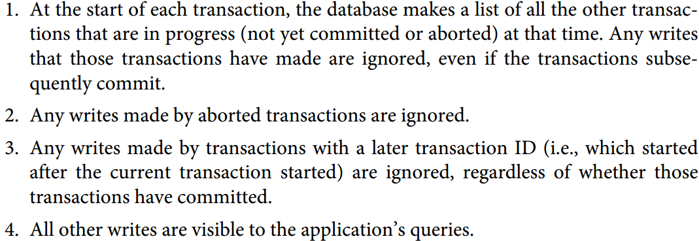

##### Lost update
- 2 read-modify-write, only 1 can succeed
- atomic write:
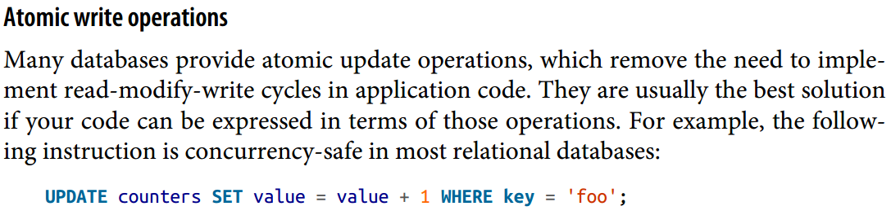
- explicit locking
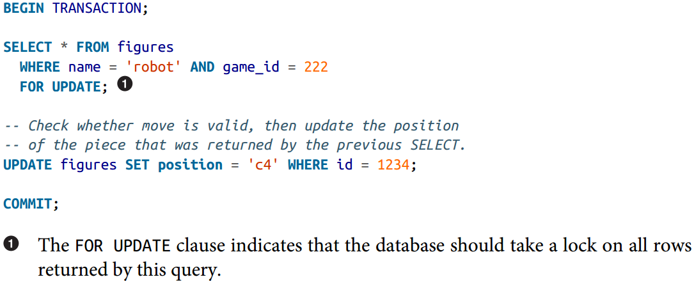
- auto-detection: if transaction manager detects a lost update, abort the transaction and force it to retry read-modify-write cycle
- atomic compare-and-set: update only if value has not changed since last read, however, check if where reads from an older snapshot
- make update commutative will help when multi-leader-> different order -> same end result

##### Write Skew & Phantom
- eg:

- one solution:

- more common examples, meeting room booking, multi-player game to move to same position, double spending etc.
- materializing conflicts since it takes a phantom and turns it into a lock conflict on a concrete set of rows

#### Serializability
- the strongest way to prevent race conditions
- 3 ways: actual serial, 2 phase locking, optimistic concurrency control

##### Actual Serial Execution
- e.g. Redis, VoltDB, single-threaded loop for executing transactions
- without concurrency, lots of time spent on network communication -> application has to submit the entire transaction code to the database ahead of time as a stored procedure

- SP gains popularity with more general-purpose programming language (lua for redis, java for VoltDB etc.)
- partition the data for better write throughput -> scale linearly with the number of CPU cores
- For transaction that needs to access multiple partitions, database needs to coordinate the transaction across all the partitions -> very slow!
- Summary:

##### Two-Phase Locking
- 2PL: writers not only blocks other writes, but also readers and vice versa
- 2PL used by the serializable isolation level in MySQL (InnoDB)
- mechanism:

- performance is way worse than weak isolation
- deadlock may lead to wasted effort

##### Predicate Lock
- similar to shared/exclusive lock, but belong to a particular object
- need to even check objects not exist yet in DB (phantoms)

##### Index-range locks
- many DB choose to use for performance Preference over Predicate Lock (both 2PL)
- applies to greater set of data, if to book a room for specific time, lock that room for all time
- not as precise as Predicate Lock, but faster due to indexed column

### serializable Snapshot Isolation
- Full Serializability, but only small performance penalty compared to snapshot isolation
- potential to become the new default
- pessimistic concurrency control: if anything could go wrong, wait till situation is safe
- serial execution: lock the entire DB, but make query small and fast
- optimistic concurrency control: instead of blocking, continue, if anything bad happened, abort and retry, hurt performance if contention is high
- On top of snapshot isolation, SSI adds an algorithm for detecting serialization conflicts among writes and determining which transactions to abort.
- Database needs to know if a query result might have changed
  - Detecting reads of a stale MVCC object version (uncommitted write occurred before the read)
  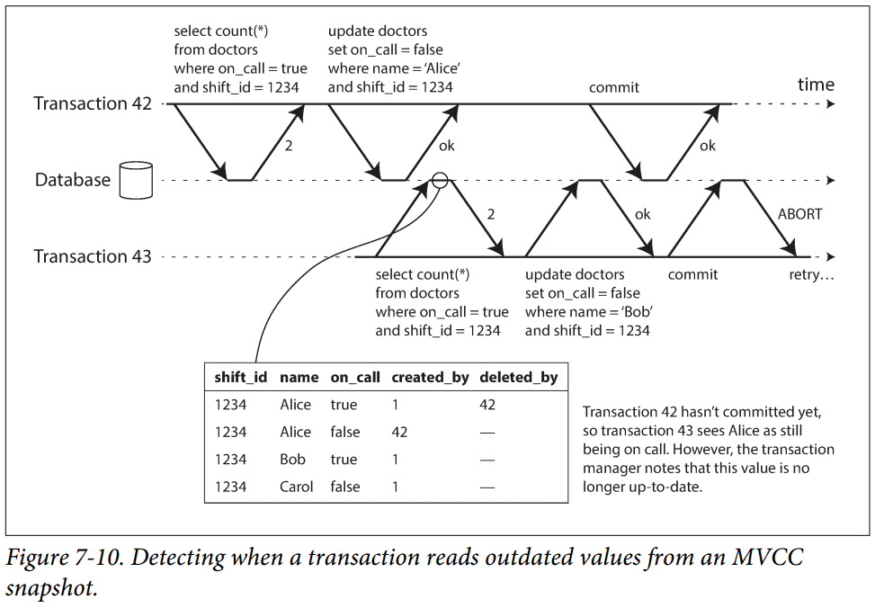
  - Detecting writes that affect prior reads (the write occurs after the read): when writes to DB, look in the indexes for any other transactions that have recently read the affected data
  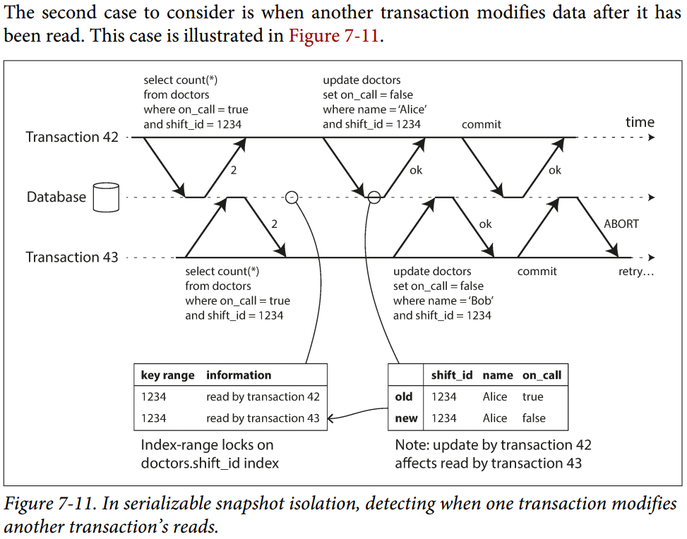
- advantage over 2PL: 1 transaction does not need to block waiting for locks held by another transaction-> predictable query latency and less variable
- advantage over serial execution: not limited to the throughput of a single CPU core (e.g. FoudnationDB distributes the detection of serialization conflicts across multiple machines)
- rate of aborts will affect performance -> prefer short read-write, long running read may be okay but not ideal

## Chapter 8: The Trouble with Distributed Systems
- 
